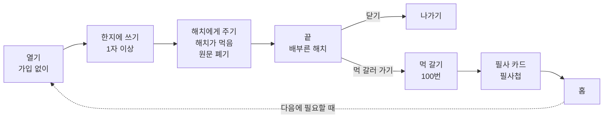

## PRD: 감정소각소 (가제) — 해치 버전

### 0. 문서 정보

| 항목 | 내용 |
| --- | --- |
| 작성일 | 2026-09-17 (v0.1) / 2026-10-06 (v0.2) |
| 버전 | v0.2 (초안) |
| 작성자 | 정민규 (v0.1) / vallog-official, Claude Code로 작성 (v0.2) |
| 근거 | 2026-10-06 팀 회의 결정, `기획/기획종합_김서영.md`, `Research/outputs/mvp-scope-decisions.md` |

#### 변경 이력

| 버전 | 날짜 | 내용 |
| --- | --- | --- |
| v0.1 | 2026-09-17 | 감정 배출 + 소각 연출 3종 + 불교 위로 문구 + 염주 108알 적립 |
| v0.2 | 2026-10-06 | **해치(해태) 테마로 전환.** 불에 태우지 않고 **적으면 해치가 먹는다.** MVP 기능을 **① 해치가 먹기 ② 먹 갈기** 두 개로 줄임. 염주, 랜덤 우체통(9/29 합의), 불교 문구는 이번 MVP에서 제외 |

v0.1 원문은 Git 기록(커밋 `1ccb63f` 등)에 남아 있다.

---

### 1. 개요

**한 줄 정의**

남겨두기 싫은 말을 한지에 적으면 **해치가 먹어 없앤다.** 마음이 남으면 **먹을 갈며** 조금 더 머물 수 있다. 원문은 어디에도 남지 않는다.

**배경**

- 감정을 털어놓고 싶어도 메모 앱이나 일기에 쓰면 기록으로 남아 다시 마주치게 된다 (`기획/brand_홍석민(챕터 4까지 완성).md` 스토리)
- 쓰고 사라지게 하는 서비스는 이미 여럿 있다 (감정 쓰레기통 계열 5개, Scream into the Void, Pixel Thoughts) [김서영] [정연화]
- 불교 리추얼 + 보상 앱인 석가머니는 염주, 소원 연등, 부처님 말씀, 꾸미기를 이미 제공한다 (App Store, 접근 2026-10-06). 그래서 불교 모티프 대신 **해치**를 대표 캐릭터로 삼는다
- 한국사 소재에 대한 관심 신호: 소설 《한국사 이상현상 연구원》 교보문고 종합 2주 연속 1위, 구매자 20대 여성 50.6% (뉴스1 등, 2026년 8~9월)

---

### 2. 타겟

v0.1과 같다. **주 타겟** 25~34세 사회초년생 및 이직·구직 준비생, **보조 타겟** 취준생.

`[조사 필요]` 사용자 인터뷰·설문은 아직 0건이다. 타겟이 이 문제를 실제로 겪는지는 검증 전이다.

---

### 3. 문제 정의

1. **배출 창구 부재**: 매번 타인에게 감정노동을 넘기는 것이 부담스럽다
2. **기록의 피로감**: 쓰면 남고, 남으면 다시 보게 된다
3. **지속 동기 부족**: 감정 관리 앱은 초반 이탈이 많다

`[조사 필요]` 세 가지 모두 출처 없는 가설이다 (`prd-review-from-competitor-analysis.md` 미확인 항목).

---

### 4. 목표와 성공 지표

| 구분 | 내용 |
| --- | --- |
| 정성 목표 | "적고 나니 후련하다", "해치에게 맡겼다"는 느낌 |
| 주 지표 | **2주(또는 30일) 안에 2번 이상 다시 사용**한 비율 — 필요할 때 쓰는 도구에 맞춘 지표 (팀 합의 8) |
| 보조 지표 | 먹인 직후 "조금 가벼워졌나요?" 5점 응답, 먹 갈기 선택률, 100회 완주율 |

MVP는 서버가 없으므로 **소규모 사용자 테스트(10명 안팎)**에서 관찰과 자가 보고로 잰다.

v0.1의 D7 20%, 주 3회 15% 목표는 매일 쓰는 앱을 전제로 한 지표라 쓰지 않는다 (팀 합의 8).

---

### 5. 핵심 기능 (MVP 두 개)

#### 5.1 해치가 먹기 (핵심)

| 단계 | 내용 |
| --- | --- |
| 열기 | 가입 없이 바로 한지 화면. 해치가 한지 뒤에서 화면 높이의 약 2/5 크기로 기다리고, 말풍선으로 "적은 것은 아무도 읽지 않소"라고 안내 (입력 전 보관 범위 안내) |
| 쓰기 | 한지에 1자 이상 입력. 글자 수 제한 없음. 키보드가 올라오면 해치는 약 1/5 크기로 줄어 한지 위로 고개만 내민다 |
| 먹이기 | "해치에게 주기"를 누르면 한지가 접히고 해치가 받아먹는다. 잔잔한 연출 1종, 약 5초, 진동 |
| 끝 | 원문 폐기 → 배부른 해치 + 한 줄("잘 먹었소. 읽지는 않았소") → [닫기] / [먹 갈러 가기] |

- 연출이 실패하면 쓴 글은 그대로 두고 다시 시도하게 한다 (랜딩의 실패 처리와 같은 원칙)
- 연출은 1종만 만든다. 선택지(분쇄기·화로·물)는 두지 않는다 (팀 합의 2)

#### 5.2 먹 갈기 (머무르기)

| 항목 | 내용 |
| --- | --- |
| 들어가는 곳 | 5.1 끝 화면의 [먹 갈러 가기] 또는 홈. **사용자가 고를 때만** 들어간다 |
| 화면 | 아래 2/3: 벼루. 손가락으로 원을 그리면 먹이 갈리고 먹물이 조금씩 진해진다 (한 바퀴마다 약한 진동과 소리) / 위 1/3: 서안 앞에 앉은 작은 해치 + 진행 표시 "필사까지 37 / 100" |
| 보상 | 먹을 **100번** 갈면 해치가 **고전 한 구절을 필사**한다 → 필사 카드(원문 + 쉬운 풀이) → 필사첩에 모인다 |
| 책 고르기 | 기본은 **랜덤**(필사할 때마다 책과 구절이 무작위). 설정에서 **원하는 책을 고정**할 수 있다. 후보 초안: 논어, 맹자, 명심보감, 소학, 채근담, 도덕경 |
| 원칙 | 중간에 나가도 진행 숫자는 줄지 않는다. 연속 기록, 경고, 압박 문구 없음. **먹이기(5.1) 횟수와 연결하지 않는다** (많이 쓸수록 보상받는 구조 방지, 팀 합의 4) |
| P1 (가능하면) | 해치 얼굴 자리에 사용자 사진 넣기. 사진은 **기기에만** 저장 |

---

### 6. 유저 플로우

---

### 7. 데이터 정책

| 구분 | 내용 |
| --- | --- |
| 원문 | 서버, 분석 로그, 기기 어디에도 저장하지 않는다. 먹이기가 끝나면 화면 메모리에서 지운다 |
| 기기에만 저장 | 먹 진행 횟수, 필사 횟수, 필사첩 구절 번호, 고른 책 설정, (P1) 해치 사진 |
| 서버 | MVP에서는 쓰지 않는다. 랜딩의 출시 알림 이메일은 별도로 수집된다 (`dev/landing/api/reserve.js`) |

---

### 8. 하지 않는 것 (팀 합의 유지)

- 스트릭, 연속 방문, 미방문 불이익, "오랜만이에요" 같은 부재 지적 문구
- 먹이기 횟수에 비례한 보상
- 원문 기반 감정 통계·리포트
- 공개 커뮤니티, 댓글
- AI 대화, 임상 진단
- 종교 용어(부처, 번뇌, 공덕), 금지어는 `brand.md`를 따른다

---

### 9. 이번 MVP에서 빼는 것 (다음 단계 후보)

| 기능 | 메모 |
| --- | --- |
| 봉수 숫자 ("오늘 전국 봉수대에 불이 N개") | 서버에 숫자 1개 필요 |
| 파발 서찰 (기존 랜덤 우체통) | 서버, 악성 문구 필터 필요 |
| 낙화놀이 | 시즌 이벤트 후보 |
| 해치 꾸미기 | 필사 횟수로 해금하는 방식 검토 |
| 이미지 첨부 (예: 불합격 메일) | 이미지도 저장하지 않는 조건 |
| 감정 태그, 알림, 계정 | — |

---

### 10. 리스크와 오픈 이슈

| # | 항목 | 상태 |
| --- | --- | --- |
| 1 | **위기 안내 제외**: 9/28 팀 결정에서는 MVP 필수(`mvp-scope-decisions.md` A7)였는데 v0.2에서 뺐다 | 팀 확인 필요 |
| 2 | **서비스 이름**: 불에 태우지 않는데 이름이 "감정소각소"이고 랜딩 문구도 "쓰고, 태우면 끝" | 이름·랜딩 문구 재검토 |
| 3 | **랜딩·웹앱 문구**: "구슬 넘기기", "우체통 시험판"이 남아 있음 | 해치 버전으로 수정 필요 |
| 4 | **해치 디자인**: 서울시 해치 캐릭터는 공공누리 4유형(상업 이용·변경 금지)이라 쓸 수 없다. 궁궐 해치상을 참고해 새로 그린다 | `[확인 필요]` 이름 상표(키프리스) |
| 5 | **고전 풀이 저작권**: 원문은 공공 자료지만 기존 번역문은 저작권이 있을 수 있다. 풀이는 팀이 직접 쓴다 | `[확인 필요]` |
| 6 | **로고·키 비주얼**: `Design/brand-draft/`의 초안은 "불타는" 모양이라 해치 버전과 맞지 않다 | 다시 제작 |
| 7 | **먹 갈기와 석가머니 염주 돌리기의 유사성**: 원을 그리는 반복 동작이 비슷해 보일 수 있다 | 연출로 차별화 |
| 8 | **수요 미검증**: 인터뷰 0건 | 5명 인터뷰 (`Research:user-interview`) |

---

### 11. 출처

- [Seokgamoney: Buddha Luck — App Store](https://apps.apple.com/us/app/seokgamoney-buddha-luck/id6778568911) (접근: 2026-10-06)
- [서울시 해치 캐릭터 사용규정](https://www.seoul.go.kr/seoul/symbol_ca.do) (접근: 2026-10-06)
- [최인서 '한국사 이상현상 연구원' 베스트셀러 1위 — 뉴스1](https://www.news1.kr/life-culture/book/6271702) (접근: 2026-10-06)
- 팀 원본 조사: `Research/outputs/경쟁사조사/`
