# 경쟁사 루프 — 서비스별 유저 루프와 끊기는 자리

| 항목 | 내용 |
| --- | --- |
| 작성일 | 2026-09-29 |
| 작성자 | 조재영 |
| 기준 문서 | [`PRD.md`](../PRD.md) v0.1 |
| 원본 조사 | [`Research/outputs/경쟁사조사/`](../Research/outputs/경쟁사조사/) — 김서영, 정민규, 정연화, 홍석민, 조재영(00~04) |
| 범위 | 경쟁사 10곳의 루프를 한 장씩 그린다. 새 조사가 아니라 팀원 원본 조사를 루프 관점으로 다시 그린 것이다 |

`[김서영]` `[정민규]` `[정연화]` `[조재영/0N]` `[홍석민]`은 위 원본 조사 파일, `[추정]`은 이 문서의 해석이다. 각 URL은 [`Research/sources/source-log.md`](../Research/sources/source-log.md)에 모아 두었다. **석가머니는 원본에 URL이 없다**(로그의 "출처가 없는 항목" 참고).

---

## 읽는 법

모든 루프를 같은 네 칸으로 나눴다.

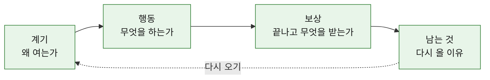

| 색 | 뜻 |
| --- | --- |
| 초록 | 이 칸은 작동한다 |
| 빨강 | **루프가 여기서 끊긴다** |
| 노랑 | 작동은 하지만 우리 정체성(원문을 남기지 않음, 프라이빗, 가벼운 톤)과 부딪친다 |
| `--x` 화살표 | 다시 오기로 이어지지 않는다 |

---

## 결론

| 끊기는 자리 | 서비스 | 한 줄 |
| --- | --- | --- |
| **남는 것이 없음** | 감쓰, Scream, 요단강 | 버리면 끝이라 다시 열 이유도 같이 사라진다 |
| **행동이 감정과 무관** | 석가머니, 불교마음 | 의식은 있지만 오늘의 감정을 쓰거나 버리는 단계가 없다 |
| **남는 것이 원문·기록** | Pixel, 아무것도아니야, MOODA, Daylio | 루프는 닫히지만 기록을 남겨서 닫는다 |
| **스트릭·기록 의존** | Finch | 가장 잘 닫힌 루프지만 스트릭과 기록에 기댄다 |

**네 칸이 모두 초록인 서비스는 없다.** 우리 루프(맨 끝)는 이 네 칸을 원문 없이 채우는 조합이다 `[추정]`.

---

## 1. 배출형 — 남는 것이 없음

### 1-1. 감쓰 (감정쓰레기통: 마음 비우기)

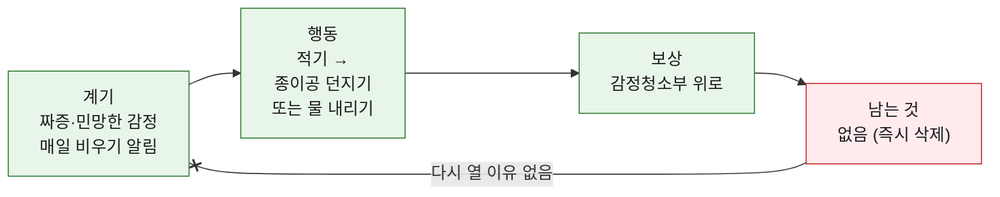

- 배출 경험은 조사한 곳 중 가장 강하다. "개발자도 못 본다"는 약속, 생체 잠금 [조재영/01]
- 글이 사라지면서 앱을 다시 열 이유도 사라진다 [조재영/01]. 알림과 감정 카드 공유가 있다는 조사도 있지만 출처가 없다 [정민규]

### 1-2. Scream into the Void

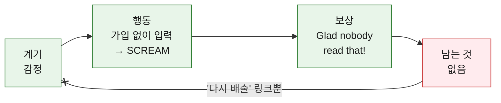

- 소멸 동작의 원형. 스트릭·수집·통계·알림 미관찰 [김서영] S1

### 1-3. 요단강 (감정쓰레기통: 요단강)

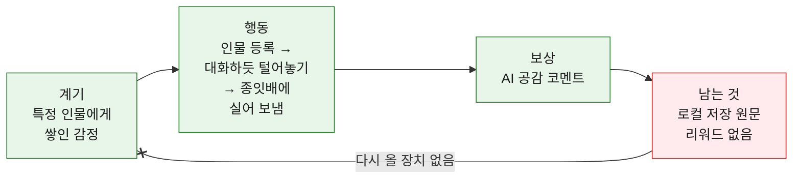

- 대상을 지정해 배출하는 차별점. 서버 전송 없이 로컬 저장 [정연화]

---

## 2. 의식형 — 행동이 감정과 무관

### 2-1. 석가머니 (Seokgamoney: Buddha Luck)

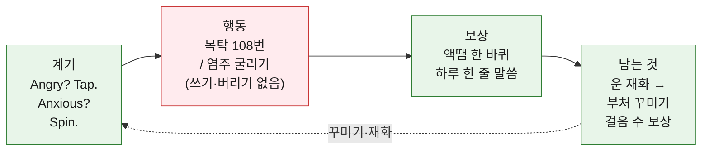

- **가장 가까운 의식형 경쟁자.** 감정 상태와 행동은 연결했지만, 감정을 적거나 버리는 과정이 없다 [정민규] [홍석민]
- 루프 자체는 재화와 꾸미기로 닫혀 있다
- ⚠️ 원본 조사에 URL이 없다. 위 내용은 `[미확인]`이다

### 2-2. 불교마음

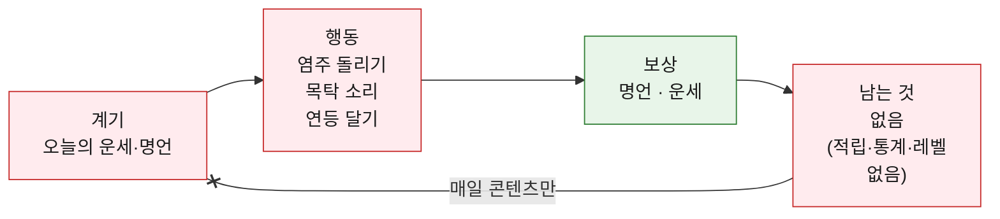

- 계기가 감정이 아니라 운세·명언이다. 염주 UX 선례이고, "연등 귀엽다" 반응이 있다 [조재영/03]
- 종교색이 강해 젊은 비신자에게는 진입장벽이다 [조재영/03]

---

## 3. 기록형 — 남는 것이 원문·기록

### 3-1. Pixel Thoughts

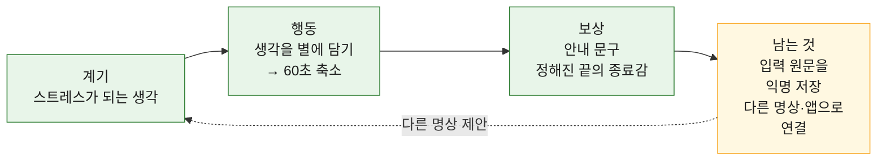

- 60초라는 **끝이 정해진 종료**가 가장 참고할 점이다 [김서영] S2
- 화면에서는 사라지지만 방침상 원문을 익명 저장한다 [김서영] S4

### 3-2. 아무것도아니야

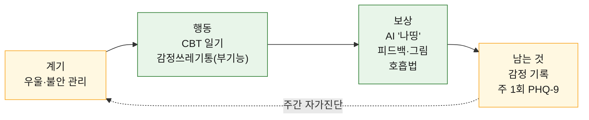

- 배출 다음 단계까지 설계해서 루프는 닫힌다. 다만 계기와 남는 것이 임상적이라 톤이 무겁다 [조재영/02]
- 기능이 많아 버그·데이터 손실 리뷰가 반복된다 [조재영/02]

### 3-3. MOODA

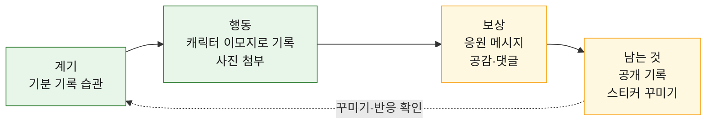

- 스티커 꾸미기가 사용자 요청으로 추가돼 크리에이터 스티커까지 확장된 사례다 [조재영/04]
- 배출이 아니라 **전시**다. 공감·댓글은 우리의 프라이빗 배출과 부딪친다

### 3-4. Daylio

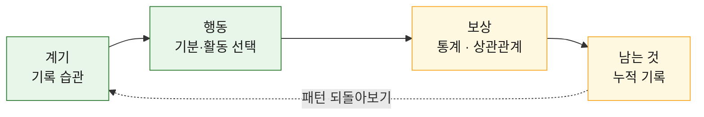

- 입력 장벽이 낮다. 기록이 쌓일수록 다시 볼 이유가 생기는 전형적인 기록형 루프다 [홍석민] [김서영] S14

---

## 4. 보상형 — 스트릭·기록 의존

### 4-1. Finch

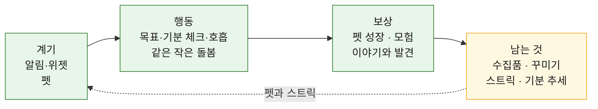

- 조사한 곳 중 **가장 잘 닫힌 루프**다. 스트릭 복구·일시정지로 부담을 줄였다 [김서영] S5~S11 [정연화]
- 보상과 스트릭을 함께 써서 어느 쪽이 재방문을 만드는지 분리할 수 없다 [김서영] 9장

---

## 5. 우리 루프 (비교용)

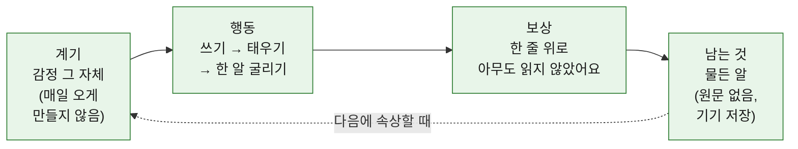

| 칸 | 가져온 곳 | 버린 것 |
| --- | --- | --- |
| 계기 | 감쓰·Scream의 "감정이 계기" | 불교마음의 운세·명언 계기 |
| 행동 | 감쓰의 버리는 감각 + 석가머니의 굴리기 | 요단강의 대화형 입력, 아무것도아니야의 CBT 일기 |
| 보상 | Scream의 안도 문구, Pixel의 정해진 끝 | AI 피드백, 공감·댓글 |
| 남는 것 | Finch·석가머니의 "행동에 따라 쌓이는 흔적" | 원문 저장(Pixel), 기록·통계(Daylio), 스트릭(Finch) |

자세한 단계와 분기는 [`유저루프_조재영.md`](./유저루프_조재영.md)에 있다.
