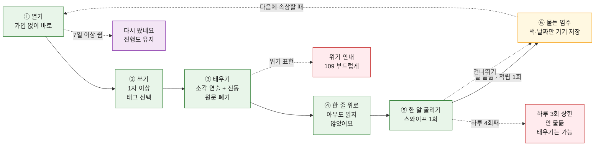

# 유저 기능 루프 — 경쟁사 루프 분해와 우리 루프 확정안

| 항목 | 내용 |
| --- | --- |
| 작성일 | 2026-09-29 |
| 작성자 | 조재영 |
| 기준 문서 | [`PRD.md`](../PRD.md) v0.1 |
| 원본 조사 | [`Research/outputs/경쟁사조사/`](../Research/outputs/경쟁사조사/) — 김서영, 정민규, 정연화, 홍석민, 조재영(00~04). URL은 [`Research/sources/source-log.md`](../Research/sources/source-log.md) |
| 이어받은 결정 | [`염주대체안_홍석민.md`](./염주대체안_홍석민.md) — 18알 염주, 한 알 굴리기로 적립, 하루 3회 상한, 쉬어도 진행도 유지 |
| 범위 | 사용자가 **들어와서 → 비우고 → 무언가 남기고 → 다시 오는** 한 바퀴 전체. 화면 단위 흐름, 분기, 루프가 쓰는 데이터 |
| 이 문서가 답하는 것 | "첫 버전에서 사용자가 실제로 도는 루프는 정확히 무엇인가" |

`[김서영]` `[정민규]` `[정연화]` `[조재영/0N]` `[홍석민]`은 원본 조사 파일, `PRD N`은 PRD의 해당 절, `[대체안 N]`은 `염주대체안_홍석민.md`의 해당 절, `[추정]`은 이 문서의 해석이다.

---

## 한눈에 보기

- 초록 = 한 바퀴(①→⑤), 노랑 = 남는 것(⑥), 빨강 = 안전 분기, 보라 = 복귀
- 레인·단계 구분이 있는 인터랙티브 버전은 [`유저루프_조재영.html`](./유저루프_조재영.html)이다. 브라우저로 열고, URL 끝에 `?theme=light`를 붙이면 밝은 테마로 고정된다

---

## 결론

**한 문장: 속상한 일을 적어 넣으면, 태워 없애 주고 염주 한 알을 물들여 준다.**

1. **경쟁사 루프는 모두 한 군데씩 끊겨 있다.** 배출형은 "남는 것"이 없어서, 의식형은 "들어올 계기"가 감정과 무관해서, 기록형은 "남는 것이 원문"이라서 끊긴다(1장). 우리 루프는 이 네 칸을 모두 채우는 가장 작은 조합이다.
2. **루프의 핵심 연결부는 ④→⑤다.** 태운 직후 한 알을 굴리는 동작이 "버림"을 "쌓임"으로 바꾼다. 여기서 원문은 사라지고 물든 알만 남는다.
3. **첫 버전은 5칸 + 분기 4개로 끝낸다.** 홍석민 대체안의 방향(한 알 굴리기, 18알, 쉬어도 잃지 않음)은 그대로 따르고, 해금 23단계·뽑기·월간 카드·알림 감쇠 규칙은 **첫 사용자가 생긴 뒤로 미루자고 제안한다**(4장). AGENTS 기준 3번 "첫 버전이 작다"에 맞추기 위해서다.

---

## 1. 경쟁사 루프 분해

루프를 네 칸으로 나눴다. **계기**(왜 여는가) → **행동**(무엇을 하는가) → **보상**(끝나고 무엇을 받는가) → **남는 것**(다음에 다시 올 이유가 되는가).

> 서비스별 루프 그림(Mermaid)은 [`경쟁사루프_조재영.md`](./경쟁사루프_조재영.md)에 있다.

| 서비스 | 계기 | 행동 | 보상 | 남는 것 | 루프가 끊기는 곳 | 출처 |
| --- | --- | --- | --- | --- | --- | --- |
| 감쓰 | 짜증·민망한 감정, 매일 비우기 알림 | 적기 → 종이공 던지기 / 물 내리기 | 감정청소부 위로 | 없음(즉시 삭제). 감정 카드 공유는 있다는 조사도 있음 | **남는 것.** 글이 사라지면서 다시 열 이유도 사라짐 | [조재영/01] [정민규] |
| Scream into the Void | 감정 | 입력 → SCREAM | "Glad nobody read that!" | 없음 | **남는 것.** "다시 배출" 링크뿐 | [김서영] S1 |
| Pixel Thoughts | 스트레스 생각 | 별에 담기 → 60초 축소 | 안내 문구, 끝이 정해진 종료감 | 다른 명상·앱으로 연결. 원문은 익명 저장 | **남는 것**이 원문(약속과 충돌) | [김서영] S2~S4 |
| 요단강 | 특정 인물에게 쌓인 감정 | 대화하듯 털어놓기 → 종잇배 | AI 공감 코멘트 | 로컬 저장 원문 | **보상 이후.** 리워드·리텐션 없음 | [정연화] |
| 아무것도아니야 | 우울·불안 관리 | CBT 일기, 쓰레기통(부기능) | AI '나띵' 피드백, 그림 | 기록, 주 1회 PHQ-9 | 루프는 닫히지만 **남는 것이 기록·진단**이라 무겁다. 버그·데이터 손실 | [조재영/02] |
| 석가머니 | "Angry? Tap. Anxious? Spin." | 목탁 치기, 염주 108번 굴리기 | 액땜 한 바퀴, 하루 한 줄 말씀 | 운 재화 → 부처 꾸미기 | **행동.** 감정을 쓰거나 버리는 단계가 없음 | [정민규] [홍석민] |
| 불교마음 | 매일 운세·명언 | 염주·목탁·연등 | 명언 | 없음(적립·레벨 없음) | **계기와 남는 것.** 감정과 연결 안 됨 | [조재영/03] |
| MOODA | 기분 기록 습관 | 이모지 기록, 사진 | 응원 메시지, 공감·댓글 | 기록, 스티커 | **남는 것이 공개 기록.** 배출이 아니라 전시 | [조재영/04] |
| Daylio | 기록 습관 | 기분·활동 선택 | 통계, 상관관계 | 누적 기록 | 남는 것이 기록(우리 정체성과 충돌) | [홍석민] [김서영] S14 |
| Finch | 알림·위젯, 펫 | 목표·기분 체크·호흡 같은 작은 돌봄 | 펫 성장, 모험, 수집 | 스트릭, 수집품, 인사이트 | 끊기진 않지만 **스트릭과 기록**에 기대고, 두 효과를 분리할 수 없음 | [김서영] S5~S11 [정연화] |

### 1-1. 끊기는 자리별로 묶으면

| 끊기는 칸 | 서비스 | 우리가 가져올 것 | 가져오지 않을 것 |
| --- | --- | --- | --- |
| 남는 것이 없음 | 감쓰, Scream, 요단강 | 행동(버리는 감각, 가입 없는 진입, 안도 문구) | "끝나면 끝"인 구조 |
| 행동이 감정과 무관 | 석가머니, 불교마음 | 보상(한 바퀴 단위, 한 줄, 꾸미기), 굴리기 UX | 감정 없는 반복 |
| 남는 것이 원문·기록 | Pixel, 아무것도아니야, MOODA, Daylio | 끝이 정해진 종료(Pixel 60초) | 원문 저장, 통계, 진단, 공개 |
| 스트릭 의존 | Finch | 작은 돌봄 행동에 보상, 페널티 없는 복귀 | 연속 기록 |

`[추정]` 네 칸을 모두 채우려면 **"감정이 계기 → 버리는 행동 → 끝이 정해진 짧은 의식 → 원문 없는 흔적"** 이 필요하다. 원본 조사에 나온 서비스 중 이 조합은 없다 [조재영/00] [정연화] [홍석민]. 다만 김서영의 지적대로 이것은 후보들 사이의 공백이고, 사용자가 원하는지는 아직 모른다 [김서영] 8장. 그래서 첫 버전은 이 루프가 **한 번이라도 다시 돌아가는지**만 확인할 크기로 만든다.

---

## 2. 우리 루프 (첫 버전)

### 2-1. 한 바퀴 단계별 정의

| # | 단계 | 사용자가 하는 것 | 시스템이 하는 것 | 남는 데이터 | 경쟁사 근거 |
| --- | --- | --- | --- | --- | --- |
| ① | **진입** | 앱(웹)을 연다 | 가입 없이 바로 입력 화면. 입력창 위에 "이 글은 어디에도 저장되지 않아요" | 없음 | Scream·Pixel 무가입 진입 [김서영], 감쓰 "개발자도 못 봄" [조재영/01] |
| ② | **쓰기** | 속상한 일을 적는다(최소 1자). 원하면 태그 1개를 고른다 | 원문은 화면 메모리에만 있음. 서버·로그로 보내지 않음 | 없음 | PRD 5.1 |
| ③ | **태우기** | "태우기" 버튼을 누른다 | 잔잔한 소각 연출 1종(글자가 타고 재가 흩어짐) + 진동. 연출이 끝나면 원문을 메모리에서 지움 | 없음 | 감쓰 연출 [조재영/01], 아무것도아니야 진동 [조재영/02], 잔잔한 연출 근거 [김서영] S19 |
| ④ | **한 줄 위로** | 읽는다 | 위로 문구 1줄 + "아무도 읽지 않았어요" | 없음 | Scream "Glad nobody read that!" [김서영], PRD 5.2 |
| ⑤ | **한 알 굴리기** | 염주 한 알을 넘긴다(스와이프 1회, 5~10초) | 굴린 알이 물듦(태그를 골랐으면 태그 색, 아니면 기본색) → **적립 1회** | 알 색, 적립 날짜 | 대체안 3.4 [대체안 3.4], Finch 작은 돌봄 행동 보상 [김서영], Pixel 끝이 정해진 종료 [김서영] |
| ⑥ | **홈** | 물든 염주를 본다. 원하면 계속 돌린다 | 18알 염주 표시. 돌리기는 언제든 가능(적립 없음) | 없음 | 석가머니·불교마음 굴리기 UX [정민규] [조재영/03] |
| ↺ | **다시 오기** | 다음에 속상할 때 연다 | (내부 계기) 감정 자체 / (외부 계기) 켜 둔 경우 저녁 알림 | — | 감쓰 알림 [정민규] |

**루프를 닫는 두 장치** `[추정]`
- **물든 알이 곧 다시 올 이유다.** 감쓰에 없는 "남는 것"을 원문 없이 만든다. 18알 중 몇 개가 물들었는지가 유일한 누적 표시다.
- **계기는 감정 그 자체다.** 매일 오게 만들지 않는다. 필요할 때 온 것을 성공으로 본다 [김서영] 8장.

### 2-2. 분기

| 분기 | 조건 | 동작 | 이유 |
| --- | --- | --- | --- |
| A. 굴리기 건너뛰기 | ⑤에서 "그냥 닫기" | 태우기는 정상 완료. 적립 없음. 경고·불이익 없음 | 의식을 강요하면 종료감이 깨진다 [대체안 3.4] |
| B. 하루 상한 | 오늘 이미 3회 적립 | 태우기는 계속 가능. ⑤에서 알이 물들지 않고 "오늘은 충분히 비웠어요" | 부정 감정을 많이 쓸수록 보상받는 구조를 막는다 [김서영] 11장 [대체안 3.4] |
| C. 위기 표현 | ③에서 태우기를 누를 때 기기 안에서 위기 키워드 감지 | 태우기는 막지 않음. ④ 대신 부드러운 안내 카드(자살예방상담전화 109 등) → 이후 ⑤로 이어짐 | 가벼운 톤을 지키면서 안전망만 둔다. 아무것도아니야는 PHQ-9로 안전장치를 두지만 톤이 임상적이다 [조재영/02]. 가벼운 배출 앱들의 안전장치 유무는 `[조사 필요]`. PRD 10.4. 판별은 기기 안에서만 |
| D. 오래 쉬다 옴 | 마지막 적립 후 7일 이상 | 홈에 "다시 왔네요" 한 줄만. 물든 알 그대로 | 진행도는 멈출 뿐 줄지 않는다 [대체안 3.1] |

> 한 바퀴 완성: 18알이 모두 물들면 "한 바퀴" 연출 후 다음 바퀴는 같은 알 위에 한 겹 더 진하게 물든다 [대체안 3.5]. 루프 자체는 바뀌지 않으므로 첫 버전에 포함한다.

### 2-3. 루프가 쓰는 데이터 (전부)

**첫 버전은 서버 없이 기기 저장(브라우저 저장소)만 쓴다.** 원문을 보내지 않는다는 약속을 코드 구조로 보장하는 가장 간단한 방법이다 `[추정]`. 요단강의 로컬 저장이 선례다 [정연화].

| 저장 | 쓰는 단계 | 저장하지 않음 |
| --- | --- | --- |
| 알별 색(태그 또는 기본색), 바퀴 수 | ⑤ 물듦, ⑥ 홈 | 원문 |
| 오늘 적립 횟수 + 날짜 | 분기 B | 글자 수, 입력 로그 |
| 마지막 적립 날짜 | 분기 D | 정확한 시각 |

홍석민 대체안 3.2의 목록(시간대 5구간, 처리 방식, 의식 완료 여부)은 월간 카드와 지표용이다. 첫 버전에 월간 카드가 없으면 필요 없다(4장).

---

## 3. 이 루프가 PRD와 다른 점

| PRD v0.1 | 이 문서 | 근거 |
| --- | --- | --- |
| 6-3. 처리 방식 선택(분쇄기·화로·물) | 연출 1종으로 시작. 선택 단계 삭제 | 감쓰가 이미 던지기·물 두 가지 연출을 제공한다 [조재영/01] [정민규]. 텍스트를 사라지게 하는 서비스도 이미 여럿이다 [김서영] S1~S2. 단계가 하나 줄면 루프가 짧아진다 |
| 6-5. 염주 1알 적립 애니메이션(자동) | ④ 사용자가 직접 한 알을 굴려야 적립 | 배출 횟수 보상의 왜곡 방지 [김서영], 대체안과 같음 |
| 6-6. 염주 돌리기로 안정(종료 조건 없음) | ⑤는 한 알로 끝남. 더 돌리는 건 ⑥ 홈에서 자유 | 끝이 정해져야 종료감이 생긴다 [김서영] Pixel |
| 5.3 108알 완성 | 18알 한 바퀴. 108은 첫 버전에서 표시하지 않음 | 첫 보상까지 108일은 멀다 [대체안 1장 2번] |
| (없음) 데이터 보관 정책 | 기기 저장만, 원문 저장 안 함 | Pixel은 화면에서는 사라져도 원문을 익명 저장한다 [김서영] S4. 감쓰는 "개발자도 못 봄" [조재영/01], 요단강은 로컬 저장 [정연화] |
| (없음) 위기 대응 | 분기 C | PRD 10.4, [조재영/02] |

---

## 4. 첫 버전에서 뺀 것 — 팀 논의 제안

홍석민 대체안은 루프 방향이 맞고, 이 문서도 그 위에 서 있다. 다만 대체안을 전부 첫 버전에 넣으면 해금 7단계에 아이템 10~11개, 출시 10일 안에 업데이트 1이 필요하다 [대체안 3.7]. AGENTS 기준 3번("완성이 아니라 작동을 먼저", "기능은 사용자가 생긴 뒤에")에 비추면 크다. 아무것도아니야처럼 기능이 많아 버그와 데이터 손실이 생긴 선례도 있다 [조재영/02].

| 항목 | 대체안 | 이 문서 제안 | 다시 넣을 조건 |
| --- | --- | --- | --- |
| 꾸미기 해금 | 1·3·6·10·15·21·28회, MVP 7개 | **1개만**: 첫 한 바퀴(18회)를 채우면 구슬 색 하나 | 한 바퀴를 채우는 사용자가 나오면 |
| 선택형 뽑기 | 해금 3번 중 1번 | 뺌 | 해금이 3개 이상 생기면 |
| 굴릴 때 소리 해금 | 2종 | 기본 소리 1종만 | 소리 켠 비율을 보고 |
| 월 1회 비움 카드 | v1 포함 | 뺌. 출시 첫 달에는 보여 줄 데이터도 거의 없음 | 출시 한 달 뒤 |
| 저강도 알림 + 빈도 감쇠 | 주 최대 3회, 2주·4주 감쇠 | 뺌. 웹 첫 버전은 푸시가 없어도 루프가 돈다 | 앱 전환 시 |
| 오늘의 한 줄(배출 없는 날) | 굴리면 하루 한 번 바뀜 | ③ 위로 문구 풀을 같이 쓰면 비용이 거의 없음 → **포함 가능**, 팀 판단 | — |
| 108 커스텀 염주 | 6바퀴 서브 목표 | 뺌(바퀴 수만 셈) | 6바퀴 도달자가 나오면 |

**뺀 뒤 첫 버전 = 화면 3개**(쓰기 / 태우기+한 줄+굴리기 / 홈 염주) **+ 분기 4개.**

---

## 5. 루프가 도는지 확인하는 방법

첫 버전은 서버가 없으므로 지표는 **소규모 사용자 테스트**로 본다(지인·수강생 10명 안팎) `[추정]`.

| 질문 | 확인 방법 | 이 루프에서 볼 곳 |
| --- | --- | --- |
| 태우고 나서 후련한가 | 태우기 직후 1문항("조금 가벼워졌나요?" 5점) | ②→③ |
| 한 알 굴리기가 귀찮은가 | 건너뛰기(분기 A) 비율, 인터뷰 | ④ |
| 다시 오는가 | 2주 안에 2회 이상 다시 태운 사람 수(본인 기기 화면 확인 또는 자가 보고) | ↺ |
| 물든 염주가 다시 올 이유였나 | 재방문자 인터뷰: "왜 다시 열었나요?" | ⑤ |

PRD 4절의 D7 20%, 주 3회 15%는 매일 쓰는 앱을 전제로 한 목표라서 이 루프에 맞지 않는다 [대체안 1장 9번].

---

## 6. 팀에 확인할 것

| # | 질문 | 이 문서의 기본값 |
| --- | --- | --- |
| 1 | 첫 버전을 웹으로 할까, 앱으로 할까 | 웹(가입·설치 없이 루프를 바로 확인 가능). Scream·Pixel도 웹 [김서영] |
| 2 | 4장의 축소안을 받을까, 대체안 MVP 범위를 유지할까 | 축소안 |
| 3 | 하루 상한 3회 유지할까 | 유지 [대체안] |
| 4 | 태그를 몇 개로, 어떤 색으로 | PRD 5.1의 5개(분노·슬픔·억울함·무기력·불안) [조사 필요: 색 매핑은 Design과 정함] |
| 5 | 위기 키워드 목록 | [조사 필요] 공개된 목록·가이드 확인 필요 |
| 6 | 서비스 이름 | 미정. 이름에 "감정쓰레기통"을 쓰는 앱이 이미 여럿이다 [정연화] [정민규] |
