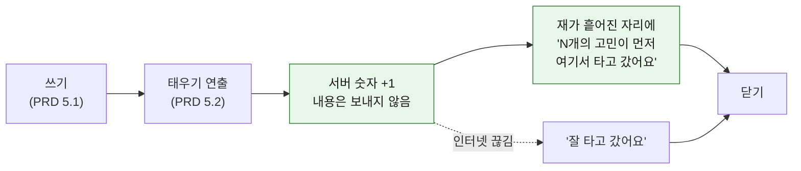

# 버린 다음 — "먼저 타고 간 고민들"

| 항목 | 내용 |
| --- | --- |
| 작성일 | 2026-09-29 |
| 작성자 | 조재영 |
| 기준 문서 | [`PRD.md`](../PRD.md) v0.1 (5.1 감정 배출, 5.2 소각 연출) |
| 원본 조사 | [`Research/outputs/경쟁사조사/`](../Research/outputs/경쟁사조사/) |
| 범위 | 태우기 연출이 끝난 **다음** 한 화면. 쓰기·태우기는 PRD 그대로 둔다 |

---

## 결론

**고민을 태우고 나면, 앞서 여기서 타고 간 고민의 수를 보여 줘서 혼자 버린 게 아니라는 걸 느끼게 한다.**

> 12,344개의 고민이 먼저 여기서 타고 갔어요

---

## 1. 이 기능이 맡는 일

버린 뒤 사용자가 앱을 닫으며 가져가길 바라는 것은 두 가지다.

| 바라는 것 | 누가 맡나 |
| --- | --- |
| **후련해져라** | 태우기 연출(PRD 5.2)이 이미 맡는다 |
| **고생했구나** | **이 기능이 맡는다** |

"고생했구나"를 말로 건네면 누구에게나 같은 인사치레가 되기 쉽다. 그래서 말 대신 **같이 버린 사람들이 있다는 사실**로 건넨다.

비유는 흡연 구역이다. 서로 모르는 사람들이 말 한마디 없이 나란히 서 있다 가지만, "나만 힘든 게 아니구나" 하는 느낌이 있다. 무엇을 버렸는지는 아무도 모르고, 여기 다녀간 사람이 있다는 것만 안다.

---

## 2. 흐름

- 한 줄을 보여 주고 끝난다. 더 할 것이 없다.
- 이 한 줄이 PRD 5.2의 **랜덤 위로 문구를 대체한다.** 두 줄을 같이 띄우면 "고생했구나"가 흐려진다.

---

## 3. 세는 방법

| 항목 | 정한 것 |
| --- | --- |
| 무엇을 세나 | 태우기를 **끝낸 횟수**. 사람 수가 아니다 |
| 저장하는 것 | 서버에 숫자 **하나**. 원문, 태그, 기기 정보, 시각은 보내지 않는다 |
| 보여 주는 숫자 | 내 것을 더하기 **전**의 값. "먼저" 타고 간 수이기 때문이다 |
| 시작값 | **0부터 정직하게.** 초반에는 "3개의 고민이 먼저…"처럼 작아도 가짜 숫자를 넣지 않는다 |
| 인터넷이 끊겼을 때 | 숫자 없이 "잘 타고 갔어요"만. 태우기는 막지 않는다 |

**문구 규칙**
- 주어는 **"고민"** 이다. 횟수를 세면서 "명"이라고 쓰면 한 사람이 여러 번 버린 것까지 사람 수로 부풀린 말이 된다.
- "타고 갔어요"처럼 **지나간 일**로 쓴다. 고민이 아직 남아 있는 것처럼 쓰지 않는다.

---

## 4. 결정 기록

| 질문 | 고른 것 | 버린 것과 이유 |
| --- | --- | --- |
| "고생했구나"를 무엇으로 주나 | 같이 버린 흔적 | 위로 문구(누구에게나 같은 말이라 빈말처럼 느껴짐) |
| 언제 기준 숫자인가 | **총 누적** | 오늘 하루(통계처럼 느껴짐), 지금 이 순간(새벽엔 혼자일 수 있음). 누적은 줄지 않는다 |
| 어떤 문장인가 | "N개의 고민이 **먼저** 여기서 타고 갔어요" | "지금까지 N개가 버려졌어요"(전체 사실일 뿐), "당신의 고민은 N번째"(나에게만 초점) |
| 사람 수인가 횟수인가 | **횟수** | 사람 수는 기기마다 익명 번호를 저장해야 한다. 숫자 하나만 두는 쪽이 첫 버전이 작고 "아무것도 남기지 않는다"와 맞는다 |

---

## 5. 경쟁사와 다른 점

| 서비스 | 버린 다음 | 이 기능과 다른 점 | 출처 |
| --- | --- | --- | --- |
| 감쓰 | 버리면 혼자 끝. 감정청소부 캐릭터 위로 | 먼저 다녀간 고민들이 보인다 | [조재영/01] |
| Scream into the Void | "Glad nobody read that!" | 아무도 안 읽었다는 안도는 같고, 거기에 "혼자가 아니다"를 더한다 | [김서영] S1 |
| MOODA | 공감을 받으려면 기록을 공개해야 함 | 내용 없이 숫자만으로 함께함을 준다 | [조재영/04] |
| 석가머니 | 의식은 있지만 함께하는 존재가 없음 | 같이 버린 흔적이 있다 | [정민규] [홍석민] (원본 URL 없음) |

---

## 6. 검증할 것

| 질문 | 방법 |
| --- | --- |
| 숫자 한 줄이 "고생했구나"로 느껴지는가 | 소규모 사용자 테스트. 태운 직후 "혼자가 아니라고 느꼈나요?" 5점 + 인터뷰 |
| 위로 문구보다 나은가 | 같은 태우기 연출에서 숫자 한 줄 vs 랜덤 위로 문구 비교 |
| 숫자가 작을 때도 작동하는가 | 출시 초기(숫자 두 자리 이하) 반응을 따로 본다 |

---

## 7. 남은 질문

| # | 질문 | 지금 기본값 |
| --- | --- | --- |
| 1 | 숫자가 커지면 표기를 어떻게 할까 (예: 1.2만) | 그대로 표기, 쉼표만 |
| 2 | 숫자를 서버에 두려면 첫 버전에 서버가 필요하다. 가장 작은 방법은 무엇인가 | 구현 단계에서 정함 |
| 3 | 유저루프 문서(18알 염주, 한 알 굴리기)와 어떻게 합칠까 | 이 문서는 태우기 직후 한 화면만 다룬다. 염주와의 관계는 팀 회의에서 정함 |
