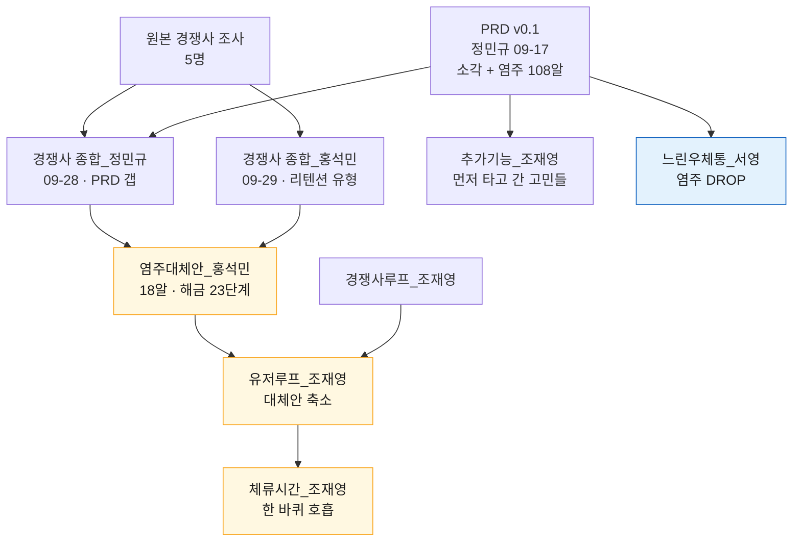
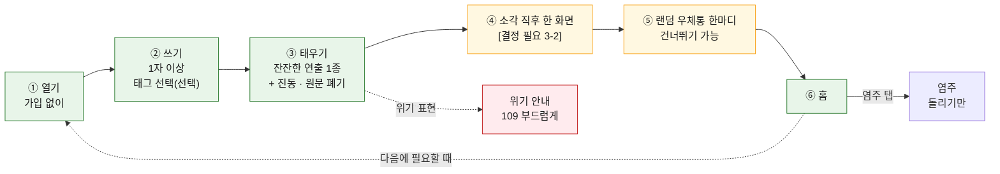

# 기획 문서 종합 — 합의된 것, 갈린 것, 정할 것

| 항목 | 내용 |
| --- | --- |
| 작성일 | 2026-09-29 |
| 작성자 | 김서영 (Claude Code로 작성) |
| 기준 문서 | `PRD.md` v0.1 (정민규, 2026-09-17) |
| 종합 대상 | `기획/` 안의 기획 문서 8건 + `PRD.md` (1장 표) |
| 원본 조사 | `Research/outputs/경쟁사조사/` — 김서영, 정민규, 정연화, 조재영(00~04), 홍석민 |

**표기**: `[김서영]` `[정민규]` `[정연화]` `[조재영/0N]` `[홍석민]` = 각 팀원의 원본 경쟁사 조사(근거). 문서 이름(예: `염주대체안_홍석민`) = 그 제안을 한 기획 문서(누가 무엇을 제안했는지). `[추정]` = 이 문서에서 새로 해석한 내용. `[조사 필요]` = 어느 문서에도 근거가 없는 빈 곳.

---

## 결정 반영 (2026-09-29 주석)

아래 결정이 나왔다. 이 문서 3-1의 "염주 vs 느린우체통" 선택은 **둘 다 넣되 역할을 나누는 것**으로 정리됐고, 뒤쪽 표와 충돌하는 곳은 각 절에 표시했다.

| 항목 | 결정 |
| --- | --- |
| 코어 | 감정을 쓰고 소각한다 |
| 랜덤 우체통 | 소각 뒤 한마디를 쓸 수 있다. **건너뛰기 가능.** 랜덤이라 상대에게 도착할지 말지 알 수 없다. 기존 `느린우체통_서영`의 "미래의 나에게 편지"와 다른 기능이다 |
| 염주 | **별도 탭.** 소각 흐름과 분리해서 바로 들어간다. 기본 제공이고, **돌리기만 가능하다.** 적립·해금·108 목표는 없다. 돌리는 감각의 퀄리티가 핵심이다 |

**이 결정으로 새로 생긴 충돌** `[추정]`

| 충돌 | 내용 |
| --- | --- |
| 합의 1 (원문 미보관) | 우체통 한마디는 다른 사람에게 가야 하므로 서버에 남는다. "원문은 남기지 않는다"의 범위를 "소각한 글"로 좁혀 적어야 한다 |
| 합의 7 (공개 커뮤니티 제외) | 랜덤 전달은 모르는 사람끼리 글이 오간다는 뜻이다. 커뮤니티는 아니지만, 악성 문구와 위기 표현을 걸러 낼 방법이 필요하다 |
| 3-4 서버 | 랜덤 전달은 서버가 있어야 한다. "서버 없는 웹" 안은 우체통을 뺄 때만 가능하다 |
| 근거 | 랜덤 우체통 계열 서비스는 원본 경쟁사 조사에 없다 `[조사 필요]` |

---

## 결론

**팀 기획은 "쓰고 → 한 번 태우고 → 원문은 남기지 않는다"는 핵심 루프에는 모두 합의했다. 갈린 곳은 "태운 뒤 무엇을 남겨서 다시 오게 할 것인가" 하나다. 여기서 두 방향으로 나뉜다.**

| | A. 염주 방향 | B. 느린우체통 방향 |
| --- | --- | --- |
| 문서 | PRD → `경쟁사 종합_정민규` → `염주대체안_홍석민` → `유저루프·체류시간_조재영` | `감정소각_느린우체통_서비스컨셉_서영` |
| 태운 뒤 남는 것 | 물든 염주 알 (원문 없음) | 사용자가 새로 쓴 한 문장, 미래 도착일까지 봉인 |
| 다시 오는 이유 | 쌓이는 흔적, 꾸미기 해금 | 과거의 내가 보낸 편지 도착 |
| 첫 보상 시점 | 첫 사용 직후 (알 1개 물듦) | 최소 7일 뒤 (첫 편지 도착) |

**회의에서 먼저 정할 것 3가지** (나머지 갈린 점은 대부분 이 3개가 정해지면 따라서 결정된다)

1. ~~리텐션 방향~~ → 주석으로 정함: 염주는 별도 탭(돌리기만), 랜덤 우체통은 소각 뒤 건너뛸 수 있는 한마디. 새로 생긴 충돌은 맨 위 "결정 반영" 참고
2. **소각 직후 한 화면**에 무엇을 띄울 것인가: 위로 문구 / "N개의 고민이 먼저 타고 갔어요" / 미래의 나에게 한 문장 → 3-2
3. **첫 버전의 크기와 서버 여부**: 서버 없는 웹(기기 저장)인가, 최소 서버가 있는가 → 3-3, 3-4

**제안** `[추정]`: 모든 문서가 합의한 공통 코어(쓰기 → 잔잔한 소각 1종 → 소각 직후 한 화면 → 홈)를 먼저 만들고, 리텐션 층(A 또는 B)은 소규모 사용자 테스트(10명 안팎, `유저루프_조재영` 5장)에서 **둘 다 종이 프로토타입이나 클릭 목업으로 반응을 본 뒤** 하나를 고른다. 둘 다 수요가 검증되지 않았기 때문이다 [김서영] 8장.

---

## 1. 검토한 문서

| # | 문서 | 작성자 · 날짜 | 역할 | 비고 |
| --- | --- | --- | --- | --- |
| 1 | `PRD.md` | 정민규 · 2026-09-17 | 기준 문서 v0.1. 소각 + 불교 위로 + 염주 108알 적립 | |
| 2 | `기획/경쟁사 종합_정민규.md` | 정민규 · 2026-09-28 | PRD 갭 분석, 가져올 요소 29개 (MVP/TEST/LATER) | |
| 3 | `기획/경쟁사 종합_홍석민.md` | 홍석민 · 2026-09-29 | 경쟁사 25개 통합, 리텐션 유형 11개, 빈틈 7개, 염주대체안에 넘길 질문 5개 | |
| 4 | `기획/염주대체안_홍석민.md` | 홍석민 · 2026-09-29 | 108알 → 18알 기본 염주 + 꾸미기 해금 23단계 + 월 1회 비움 카드. PRD 5.3~11 수정 문안 | |
| 5 | `기획/염주대체안_정민규.md` | 정민규 | — | **빈 파일 (0바이트).** 원격 커밋에서도 비어 있음 |
| 6 | `기획/경쟁사루프_조재영.md` | 조재영 · 2026-09-29 | 경쟁사 10곳의 루프를 계기 → 행동 → 보상 → 남는 것으로 분해 | |
| 7 | `기획/유저루프_조재영.md` (+ `.html`) | 조재영 · 2026-09-29 | 우리 루프 ①~⑥ + 분기 4개 확정안. 대체안을 첫 버전용으로 축소 | html은 같은 내용의 인터랙티브 다이어그램 |
| 8 | `기획/체류시간_조재영.md` | 조재영 · 2026-09-29 | 체류 장치 5유형, "한 바퀴 호흡" 제안 | |
| 9 | `기획/추가기능_조재영.md` | 조재영 · 2026-09-29 | 태운 직후 "N개의 고민이 먼저 여기서 타고 갔어요" | 문서 제목은 "버린 다음" |
| 10 | `기획/느린우체통컨셉_김서영.md` | 김서영 · 작성일 `[미확인]` | 염주를 빼고 소각 + 미래의 나에게 한 문장(느린우체통) | 머리 표 없음 |

### 문서 사이의 관계

- 노랑 = 염주 방향(A). 문서끼리 서로 이어받으며 좁혀졌다.
- 파랑 = 느린우체통 방향(B). 다른 기획 문서를 참조하지 않고 PRD에서 바로 갈라졌다.
- `추가기능_조재영`은 소각 직후 한 화면만 다루고, 염주와의 관계는 "팀 회의에서 정함"으로 남겨 두었다.

---

## 2. 합의된 것

모든 기획 문서가 같은 방향이거나, 반대하는 문서가 없는 항목이다. PRD v0.2에 그대로 넣어도 되는 후보다.

| # | 항목 | 합의 내용 | 지지 문서 | 근거 원본 |
| --- | --- | --- | --- | --- |
| 1 | **원문 미보관** | 원문은 서버·분석 로그에 남기지 않는다. 태운 뒤 다시 읽을 수 없다. PRD에는 이 절이 아예 없으므로 신규 절이 필요하다 | 정민규 종합 #1, 홍석민 종합 5장 2번, 대체안 5.5, 유저루프 2-3, 느린우체통 7장 | Pixel은 화면에서 사라져도 원문을 익명 저장 [김서영] S4. 감쓰 "개발자도 못 봄" [조재영/01], 요단강 로컬 저장 [정연화] |
| 2 | **소각 연출은 1종, 잔잔하게** | PRD 5.2의 분쇄기·화로·물 선택지를 없애고 1종으로 시작한다. 파괴보다 잔잔한 쪽 | 정민규 종합 #6, 유저루프 3장, 느린우체통 STEP 2 | 각성을 높이는 활동은 분노 감소 효과가 없었음(메타분석) [김서영] S19. 감쓰가 이미 연출 2종 제공 [조재영/01] |
| 3 | **스트릭·미방문 불이익 없음** | 연속 기록, 만료, 리셋, 부재를 지적하는 문구를 쓰지 않는다. 오래 쉬고 와도 잃는 것이 없다 | 정민규 종합 #18, 대체안 3.1, 유저루프 분기 D, 느린우체통 16장 | Finch 스트릭 복구·페널티 없는 복귀 [김서영] [정연화], 강제 스트릭 DROP [김서영] |
| 4 | **배출 횟수에 비례하는 보상 금지** | "배출 1회 = 1알"을 버린다. 부정 감정을 많이 쓸수록 보상받는 구조를 만들지 않는다 | 정민규 종합 #15, 대체안 1장 1번, 유저루프 분기 B, 느린우체통 8장 DROP | 분노 표현량 비례 보상 DROP [김서영] 11장, Finch는 작은 돌봄 행동에 보상 [김서영] |
| 5 | **PRD 5.4 감정 리포트는 원래 형태로 하지 않는다** | 원문·감정 기록을 쌓는 통계는 소멸 정체성과 충돌한다. 유료화도 하지 않는다 | 홍석민 종합 5장 3번, 대체안 5.4 (원문 없는 월 1회 카드로 대체), 유저루프 4장 (첫 버전에서 뺌), 느린우체통 LATER | 감정 통계는 미보관과 긴장 관계 [김서영] 11장 |
| 6 | **첫 버전은 작게** | 기능을 줄여 안정성부터 확보한다 | 정민규 종합 #28, 유저루프 4장, 체류시간 0장, 느린우체통 9장 | 아무것도아니야는 기능이 많아 버그·데이터 손실 리뷰 반복 [조재영/02] |
| 7 | **넣지 않을 것** | 공개 커뮤니티·공감 댓글, PHQ-9 같은 임상 진단, MVP 단계의 AI 자유 대화, 유료 다운로드 | 정민규 종합 5장, 체류시간 2-4, 느린우체통 9장 | 프라이빗 배출과 충돌, 임상 톤 [조재영/02], 유료 앱 진입장벽 [조재영/01] |
| 8 | **PRD의 D7 20% · 주 3회 15% 목표는 맞지 않는다** | 매일 쓰는 앱을 전제로 한 지표다. **"30일 안에 2회 이상 다시 사용"** 같은 필요 시 사용 지표로 바꾼다 | 대체안 11장, 유저루프 5장 (2주 안 2회), 느린우체통 11장 (30일 내 2회) | "낮은 일간 방문율만으로 실패를 판단하면 안 된다" [김서영] 8장 |
| 9 | **종교색은 가볍게** | 종교 앱처럼 보이지 않게 한다. 설교 말투와 종교 용어(부처, 공덕, 번뇌 등)는 빼고, 불교 모티프는 귀엽게 재해석한다 | 정민규 종합 #11, 대체안 3.9 (느린우체통 14장 6번은 "얼마나 유지할지"를 열린 질문으로 둠) | 불교마음 종교색 진입장벽, "연등 귀엽다" [조재영/03] |
| 10 | **서비스 이름 변경 검토** | '감정쓰레기통' 이름의 앱이 4개 이상 있다 | 정민규 종합 #29, 홍석민 종합 5장 7번, 유저루프 6장 6번 | [정연화] [정민규] |
| 11 | **가입 없이 첫 사용** | 설치·가입 없이 바로 쓰기 화면 | 정민규 종합 #2, 유저루프 ① | Scream·Pixel 무가입 [김서영] |
| 12 | **핵심 기능은 무료** | 배출·소각·기본 흐름은 무료. 유료는 꾸미기·연출 확장만 | 정민규 종합 #23, 대체안 9장 | Finch·MOODA 기본 무료 [김서영] [조재영/04] |

---

## 3. 갈린 것

### 3-1. 리텐션 방향: 염주(A) vs 느린우체통(B) — **가장 큰 결정**

> **주석으로 정리됨**: 둘 중 하나를 고르지 않는다. 염주는 별도 탭에서 돌리기만 하고, B는 "미래의 나에게 편지"가 아니라 소각 뒤 건너뛸 수 있는 **랜덤 우체통 한마디**로 바뀐다. 아래 표는 결정 전의 A/B 비교라서 B 열의 "도착일 선택·미래의 나·첫 보상 7일 뒤"는 더 이상 해당하지 않는다.

| 비교 축 | A. 염주 (대체안 + 유저루프 축소안) | B. 느린우체통 |
| --- | --- | --- |
| 태운 뒤 사용자 행동 | 한 알 굴리기 (스와이프 1회, 5~10초) | 미래의 나에게 한 문장 쓰기 + 도착일 선택 |
| 남는 데이터 | 알 색, 적립 날짜, 바퀴 수 | 편지 내용(사용자가 새로 쓴 것), 발송일·도착일, 상태 응답 |
| 첫 보상 | 첫 사용 직후 알 1개 물듦 | 가장 빠른 옵션도 7일 뒤 |
| 재방문 계기 | 감정 그 자체 + 쌓인 흔적 | 편지 도착 알림 (시간이 만든 계기) |
| 종교색 | 염주라는 오브젝트 자체가 불교적 | 108일 배송 옵션만 불교 모티프 (TEST) |
| 경쟁사 근거 | 석가머니 한 바퀴·꾸미기 [정민규] [홍석민], Finch 돌봄 보상 [김서영], 108배 [정연화] | **원본 조사에 "미래의 나에게 편지" 계열 서비스가 없다** `[조사 필요]` |
| 소각 종료감과의 관계 | 5~10초 동작으로 끝남. 종료감을 해칠 위험은 적다고 봄 (대체안 3.12 가설) | 소각 직후 한 번 더 쓰기를 요구. `체류시간_조재영`은 비슷한 "소원 연등"(태운 뒤 바라는 것 한 줄)을 "쓰기를 한 번 더 요구해 루프가 길어진다"는 이유로 LATER·TEST로 미룸 |
| 구현에 필요한 것 | 기기 저장만으로 가능 (유저루프 2-3) | 몇 달 뒤 도착하는 편지를 잃지 않을 저장소 + 도착 알림(푸시). 웹 첫 버전에는 푸시가 없다는 유저루프 전제와 충돌 `[추정]` |
| 약점 | 수요 미검증. 염주가 종교적으로 읽힐 수 있음 | 수요 미검증. 첫 재방문 계기까지 최소 7일, 그 사이 이탈 위험 — 대체안이 108알을 비판한 "첫 보상까지 너무 멀다"와 같은 구조 `[추정]` |

**합치는 안** `[추정]`: 두 방향은 배타적이지 않다. 예) 소각 → 한 알 굴리기(A)로 루프를 닫고, 느린우체통(B)은 홈에서 원할 때만 쓰는 선택 기능으로 둔다. 다만 첫 버전 크기 원칙(합의 6번)과 부딪치므로 **첫 버전에는 하나만** 넣는 것이 문서들의 공통 원칙과 맞다.

### 3-2. 소각 직후 한 화면에 무엇을 띄울까

세 문서가 같은 자리에 서로 다른 것을 제안했다. `추가기능_조재영`은 "두 줄을 같이 띄우면 흐려진다"고 명시했다.

| 후보 | 예시 문구 | 제안 문서 | 필요한 것 | 근거 |
| --- | --- | --- | --- | --- |
| ① 위로 문구 + 안도 | "아무도 읽지 않았어요" / "여기까지 두고 갈게요" | PRD 5.2, 정민규 종합 #4, 유저루프 ④, 느린우체통 STEP 2 | 문구 풀. 문구 소모 리스크 (PRD 10.2) | Scream "Glad nobody read that!" [김서영] S1 |
| ② 먼저 타고 간 고민 수 | "12,344개의 고민이 먼저 여기서 타고 갔어요" | 추가기능_조재영 | **서버에 숫자 1개.** 유저루프의 "첫 버전 서버 없음"과 충돌 | 비교 근거만 있음 (감쓰·Scream·MOODA와의 차이) [조재영/01] [김서영] [조재영/04]. 효과 근거는 없음 → TEST 제안 |
| ③ 미래의 나에게 한 문장 | "버린 마음 말고, 남기고 싶은 말이 있나요?" | 느린우체통 STEP 3 | 3-1에서 B를 고를 때만 | `[조사 필요]` |

- ①과 ②는 문구 한 줄이라 A/B 비교가 쉽다(추가기능 6장이 이미 제안).
- ③은 3-1의 결정에 따라 자동으로 정해진다.

### 3-3. 첫 버전 크기

| 항목 | 염주대체안_홍석민 (MVP) | 유저루프_조재영 (축소안) | 느린우체통_서영 (MVP) |
| --- | --- | --- | --- |
| 꾸미기 해금 | 7단계, 아이템 10~11개 | 1개 (첫 한 바퀴 18회 달성 시 구슬 색 1개) | 없음 (DROP) |
| 선택형 뽑기 | 해금 3번 중 1번 | 뺌 | 없음 |
| 월 1회 비움 카드 | v1 포함 | 뺌 (첫 달엔 데이터도 없음) | 월간 리포트 LATER |
| 알림 | 주 최대 3회 + 2주·4주 감쇠 | 뺌 (웹 첫 버전) | 편지 도착 알림은 핵심 |
| 오늘의 한 줄 | 포함 | 팀 판단 (비용 작음) | — |
| 한 바퀴 호흡 | — | 체류시간 문서에서 TEST · 첫 버전 후보 | — |
| 출시 후 부담 | 헤비 유저는 약 10일이면 MVP 해금 소진 → 10일 안에 업데이트 1 필요 (대체안 3.7) | 없음 | 편지 기능 11개 항목 (9장 KEEP) |
| 화면 수 | `[미확인]` (문서에 명시 없음) | 3개 + 분기 4개 | `[미확인]` (STEP 10개) |

`유저루프_조재영`은 대체안 방향을 따르되 범위만 줄였다. A를 고른다면 **축소안과 대체안 중 어느 범위로 갈지**가 두 번째 결정이다.

### 3-4. 서버와 플랫폼

| 문서 | 입장 |
| --- | --- |
| 유저루프_조재영 | 첫 버전은 웹, 서버 없이 기기 저장만. "원문을 보내지 않는다"를 코드 구조로 보장 |
| 추가기능_조재영 | 서버에 누적 숫자 1개 필요. "가장 작은 방법은 구현 단계에서 정함" |
| 느린우체통_서영 | 편지 보관·도착 알림 필요. 서버 언급은 없으나 데이터 정책 7장이 "지정된 도착일까지 보관"을 전제 |
| 정민규 종합 | 가입 없이 시작, 계정은 염주 백업이 필요할 때만 |

→ 3-1·3-2의 결정에 따라 정해진다. A + ①이면 서버 없이 가능, ②나 B를 고르면 최소 서버가 필요하다 `[추정]`.

### 3-5. 처리 방식 선택과 태그 연결

| 문서 | 입장 |
| --- | --- |
| 정민규 종합 #5 (MVP) | 감정 태그와 의식을 연결 (분노 → 목탁, 불안 → 염주, 슬픔 → 흘려보내기) |
| 유저루프_조재영 3장 | 처리 방식 선택 단계를 삭제하고 연출 1종 |
| 대체안 3.4 | 태그를 골랐으면 알을 태그 색으로 물들임 `[추정]` |

→ 합의 2번(연출 1종)과 정민규 #5가 충돌한다. 연출 1종으로 가면 태그의 역할은 **알 색**(대체안·유저루프) 정도로 줄어든다.

### 3-6. 108의 쓰임

| 문서 | 108 |
| --- | --- |
| PRD | 108알 = 팔찌 완성 (메인 목표) |
| 대체안_홍석민 | 18알 × 6바퀴 = 108, 홈에 드러내지 않는 서브 목표 |
| 유저루프_조재영 | 첫 버전에서 표시하지 않음 (바퀴 수만 셈) |
| 느린우체통_서영 | 108일 배송 옵션 (TEST) |

→ 모든 문서가 108을 메인 목표에서 내렸다. 남은 질문은 "브랜드 장치로 쓸지"뿐이었다.

> **주석으로 정리됨**: 염주는 기본 제공이고 돌리기만 가능하다. 바퀴 수·알 적립·108 표시는 없으므로 108은 쓰지 않는다. 위 표의 "바퀴 수만 셈"(유저루프)과 "108일 배송 옵션"(느린우체통)도 함께 빠진다.

### 3-7. 비운 감정을 다시 떠올리게 하는 장치

| 장치 | 제안 | 반대 |
| --- | --- | --- |
| 며칠 뒤 태그 기반 안부 ("그 일은 좀 괜찮아졌어요?") | 정민규 종합 #20 (TEST) | 대체안 2장 #12 (제외: "비운 감정을 다시 떠올리게 한다") |
| 편지를 읽은 뒤 "그날의 마음은 지금 어떤가요?" | 느린우체통 STEP 9 | 명시적 반대는 없음. 다만 대체안의 제외 이유와 같은 긴장이 있다 `[추정]` — 편지 본문은 원문이 아니라 사용자가 새로 고른 말이라는 점이 차이 |

---

## 4. 통합 MVP 초안 (제안)

합의된 부분만으로 만든 공통 코어다. 갈린 곳은 `[결정 필요]` 칸으로 남겼다. `[추정]`

| 단계 | 확정 여부 | 내용 |
| --- | --- | --- |
| ① 열기 | 합의 | 가입 없이. 입력창 위에 "이 글은 어디에도 저장되지 않아요" (유저루프 ①) |
| ② 쓰기 | 합의 | PRD 5.1 그대로. 태그 5개는 선택 |
| ③ 태우기 | 합의 | 잔잔한 연출 1종 + 진동. 연출이 끝나면 원문 폐기 |
| 위기 분기 | **정민규 종합·유저루프만 제안** | 기기 안에서 위기 키워드 감지 → 태우기는 막지 않고 부드러운 안내. 느린우체통 문서에는 안전장치 언급이 없다. 키워드 목록은 `[조사 필요]` |
| ④ 소각 직후 | 결정 필요 | 3-2의 ①·② 중 하나 (B를 고르면 ③) |
| ⑤ 남기는 것 | **주석으로 정함** | 랜덤 우체통 한마디. 쓸 수도, 건너뛸 수도 있다. 도착 여부는 알 수 없다 |
| ⑥ 홈 | **주석으로 정함** | 쓰기 진입 + **염주 탭**(돌리기만, 바로 진입) |

---

## 5. 회의 안건 (결정 순서)

앞의 결정이 뒤의 결정을 좁히는 순서로 놓았다.

| 순서 | 안건 | 선택지 | 이 결정으로 정해지는 것 |
| --- | --- | --- | --- |
| 1 | ~~리텐션 방향~~ (주석으로 정함) | 염주는 별도 탭·돌리기만, 랜덤 우체통은 소각 뒤 선택. 남은 질문은 우체통의 서버·검열 방식 | 3-2 ③, 3-4 서버, 3-6 108, 3-7, 홈 화면 |
| 2 | 소각 직후 한 화면 | 위로 문구 / 먼저 타고 간 고민 수 / 둘을 A/B | 서버 필요 여부 |
| 3 | 첫 버전 범위 | (A라면) 대체안 MVP / 유저루프 축소안. (B라면) 느린우체통 KEEP 11개 중 어디까지 | 출시 후 업데이트 부담 |
| 4 | 플랫폼 | 웹 (기기 저장) / 최소 서버 / 앱 | 알림 가능 여부 |
| 5 | 서비스 이름 | 후보 회의 | — |
| 6 | PRD v0.2 반영 | 2장 합의 12개를 먼저 반영 | — |

---

## 6. 검증할 가설 (문서별 제안 통합)

| 가설 | 검증 방법 | 제안 문서 | 어느 방향에 필요한가 |
| --- | --- | --- | --- |
| 소각 연출이 단순 삭제보다 종료감을 높인다 | 단순 삭제 vs 연출 1종, 직후 "조금 가벼워졌나요?" 5점 | 정민규 종합 7장, 느린우체통 가설 1, 유저루프 5장 | 공통 |
| 원문을 저장하지 않는다는 점이 선택 이유가 된다 | 미보관 안내 전후 신뢰도, 인터뷰 | 정민규 종합 7장, 느린우체통 가설 2 | 공통 |
| 필요할 때 다시 온다 | 30일(또는 2주) 안에 2회 이상 사용 비율 | 대체안 11장, 유저루프 5장, 느린우체통 가설 4 | 공통 |
| 먼저 타고 간 고민 수가 위로 문구보다 "혼자가 아니다"를 준다 | 숫자 한 줄 vs 위로 문구, 5점 + 인터뷰 | 추가기능 6장 | 공통 (④) |
| 불교 문구 vs 비종교 문구 | 문구 풀 A/B | 정민규 종합 7장, 대체안 3.9 | 공통 |
| 한 알 굴리기가 종료감을 해치지 않고 적립 동기가 된다 | 건너뛰기 비율, 직후 종료감 | 대체안 3.12, 유저루프 5장 | A |
| 짧은 해금 주기가 초반 이탈을 줄인다 | 해금 1~3번 도달률 | 대체안 3.12 | A (대체안 범위일 때) |
| 태운 뒤 한 바퀴 호흡을 스스로 고르고, 더 가벼워진다 | 선택률, 완주율, 전후 5점 | 체류시간 2-2 | A |
| 버리고 한 문장만 미래에 받는 경험이 의미 있다 | 편지 작성 완료율, 도착 후 열람률·만족도, 답장률 | 느린우체통 가설 3 | B |
| 편지 도착이 스트릭 없이 재방문 계기가 된다 | 도착 알림 → 복귀율 | 느린우체통 가설 4 | B |
| 108일이 7·30일보다 브랜드적으로 의미 있다 | 기간별 선택 비율, 이해도, 거부감 | 느린우체통 가설 5 | B |

---

## 7. 빈 곳

| 항목 | 상태 |
| --- | --- |
| "미래의 나에게 편지" 계열 경쟁 서비스 | `[조사 필요]` 원본 경쟁사 조사 5건에 없다. B를 고른다면 먼저 조사해야 한다 |
| 위기 키워드 목록과 안내 방식 | `[조사 필요]` (유저루프 6장 5번) |
| 호흡 속도(숨 한 번 6~10초) 근거 | `[조사 필요]` (체류시간 4장 3번) |
| 석가머니, Studio Handot, 목탁치기 | 원본 조사에 URL이 없어 `[미확인]` (`source-log.md` "출처가 없는 항목") |
| 사용자 수요 | 어느 문서도 사용자 인터뷰·설문을 하지 않았다. 모든 방향이 가설 단계다 [김서영] 8장 |
| `염주대체안_정민규.md` | 빈 파일. 작성 예정이었는지 확인 필요 |

---

## 8. 파일 정리 메모

2026-09-29에 정리를 마쳤다.

- `PRD.md`와 `기획/`을 팀 규칙(루트 `AGENTS.md`)대로 저장소 루트로 되돌렸다. 팀원 기획 문서의 `../PRD.md`, `Research/outputs/경쟁사조사/` 링크가 다시 맞는다.
- 사본 2개(`경쟁사 종합_정민규.md` 중복본, PRD 사본 `emotional_trash_bin_PRD.md`)를 지웠다.
- 이 문서의 파일명을 `planning-synthesis.md`에서 `기획종합_김서영.md`로, 느린우체통 컨셉 문서를 `느린우체통컨셉_김서영.md`로 바꿨다(`기획/`의 `주제_이름.md` 규칙).
- 출처 로그를 `Research/sources/source-log.md` 하나로 합쳤다.
