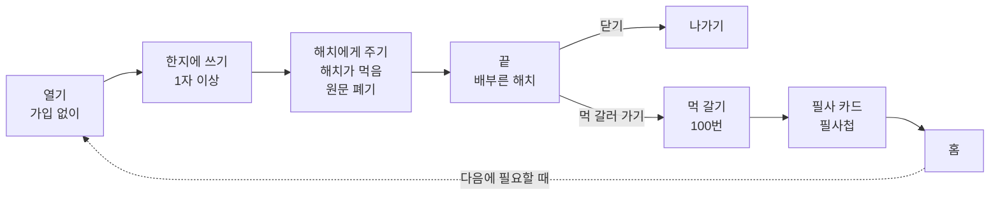

# 해치 MVP 기획안 — 적으면 해치가 먹는다

| 항목 | 내용 |
| --- | --- |
| 작성일 | 2026-10-06 |
| 작성자 | 정연화 (Claude Code로 작성) |
| 기준 문서 | [`PRD.md`](../PRD.md) v0.1 |
| 원본 조사 | [`Research/outputs/경쟁사조사/`](../Research/outputs/경쟁사조사/), 신규 출처는 [`Research/sources/source-log.md`](../Research/sources/source-log.md) "2026-10-06 해치 MVP 기획안 출처" |
| 상태 | 10/6 회의 결정을 정리한 기획안. **PRD 반영 전** |

---

## 결론

**남겨두기 싫은 말을 한지에 적으면 해치가 먹어 없앤다. 마음이 남으면 먹을 갈며 조금 더 머문다. 원문은 어디에도 남지 않는다.**

- 불교 테마 대신 **해치(해태)**를 대표 캐릭터로 쓴다
- 불에 태우지 않는다. **적으면 해치가 먹는다**
- MVP 기능은 두 개뿐이다: **① 해치가 먹기 ② 먹 갈기**

---

## 1. 왜 바꾸나

| 근거 | 내용 |
| --- | --- |
| 석가머니와 겹침 | 석가머니가 염주 돌리기, 나만의 염주, **소원 연등**(인앱 $0.49 · $6.99), 오늘의 부처님 말씀, 부처 꾸미기를 이미 제공한다 (App Store, 접근 2026-10-06). 9/29 합의안(염주 탭, 랜덤 우체통)을 그대로 가면 따라 한 것처럼 보인다 |
| 남는 차별점 | 석가머니에 없는 것은 **감정을 글로 쓰고 없애는 것**과 **원문 미보관**이다. 석가머니는 사용자 콘텐츠를 본인 정보와 연결해 수집한다고 개인정보 라벨에 표기한다 |
| 한국사 소재 관심 | 소설 《한국사 이상현상 연구원》 교보문고 종합 2주 연속 1위, 구매자 20대 여성 50.6% (뉴스1 등, 2026년 8~9월) `[추정: 소설 흥행이 앱 수요로 이어진다는 근거는 없음]` |

---

## 2. 9/29 합의안과 달라지는 점

| 9/29 합의 (`기획종합_김서영.md`) | 이 기획안 |
| --- | --- |
| 불교 모티프, 쓰고 소각 | **해치**, 쓰면 해치가 먹음 |
| 소각 뒤 랜덤 우체통 한마디 | 이번 MVP에서 제외 (다음 단계: 파발 서찰) |
| 염주 별도 탭, 돌리기만 | **먹 갈기**로 대체 |
| 위기 안내 MVP 필수 (`mvp-scope-decisions.md` A7) | **제외** — 6장 오픈 이슈 |

유지하는 합의: 원문 미보관, 가입 없이 시작, 연출 1종, 스트릭·미방문 불이익 없음, 쓴 횟수에 비례한 보상 없음, 공개 커뮤니티·AI 대화 없음, 종교 용어 없음.

---

## 3. 기능 ① 해치가 먹기 (핵심)

| 단계 | 내용 |
| --- | --- |
| 열기 | 가입 없이 바로 한지 화면. 해치가 한지 뒤에서 화면 높이의 약 2/5 크기로 기다리고, 말풍선으로 "적은 것은 아무도 읽지 않소"라고 안내 (입력 전 보관 범위 안내) |
| 쓰기 | 한지에 1자 이상 입력. 글자 수 제한 없음. 키보드가 올라오면 해치는 약 1/5 크기로 줄어 한지 위로 고개만 내민다 |
| 먹이기 | "해치에게 주기"를 누르면 한지가 접히고 해치가 받아먹는다. 잔잔한 연출 1종, 약 5초, 진동 |
| 끝 | 원문 폐기 → 배부른 해치 + 한 줄("잘 먹었소. 읽지는 않았소") → [닫기] / [먹 갈러 가기] |

- 연출이 실패하면 쓴 글은 그대로 두고 다시 시도하게 한다 (랜딩 `dev/landing/landing.js`의 실패 처리와 같은 원칙)

## 4. 기능 ② 먹 갈기 (머무르기)

| 항목 | 내용 |
| --- | --- |
| 들어가는 곳 | 기능 ①의 끝 화면 또는 홈. **사용자가 고를 때만** |
| 화면 | 아래 2/3: 벼루. 손가락으로 원을 그리면 먹이 갈리고 먹물이 조금씩 진해진다 (한 바퀴마다 약한 진동과 소리) / 위 1/3: 서안 앞에 앉은 작은 해치 + 진행 표시 "필사까지 37 / 100" |
| 보상 | 먹을 **100번** 갈면 해치가 **고전 한 구절을 필사** → 필사 카드(원문 + 쉬운 풀이) → 필사첩에 모인다 |
| 책 고르기 | 기본은 **랜덤**(필사할 때마다 책과 구절이 무작위). 설정에서 **원하는 책을 고정**할 수 있다. 후보 초안: 논어, 맹자, 명심보감, 소학, 채근담, 도덕경 |
| 원칙 | 중간에 나가도 진행 숫자는 줄지 않는다. 연속 기록, 경고, 압박 문구 없음. **먹이기 횟수와 연결하지 않는다** (많이 쓸수록 보상받는 구조 방지) |
| 가능하면 (P1) | 해치 얼굴 자리에 사용자 사진 넣기. 사진은 **기기에만** 저장 |

## 5. 흐름과 데이터

| 구분 | 내용 |
| --- | --- |
| 원문 | 서버, 분석 로그, 기기 어디에도 저장하지 않는다 |
| 기기에만 저장 | 먹 진행 횟수, 필사 횟수, 필사첩 구절 번호, 고른 책 설정, (P1) 해치 사진 |
| 서버 | MVP에서는 쓰지 않는다 (랜딩의 출시 알림 이메일은 별도) |

**이번 MVP에서 빼는 것 (다음 단계 후보)**: 봉수 숫자, 파발 서찰(랜덤 우체통), 낙화놀이, 해치 꾸미기, 이미지 첨부, 감정 태그, 알림, 계정

**확인 방법 (소규모 테스트 10명 안팎)**: 먹인 직후 "조금 가벼워졌나요?" 5점, 먹 갈기 선택률과 100회 완주율, 2주 안에 2번 이상 다시 사용한 사람 수 (`기획종합_김서영.md` 합의 8과 같은 기준)

---

## 6. 오픈 이슈

| # | 항목 | 할 일 |
| --- | --- | --- |
| 1 | **위기 안내 제외**: 9/28 결정에서는 MVP 필수(A7)였다 | 팀 확인 |
| 2 | **서비스 이름**: 불에 태우지 않는데 이름이 "감정소각소", 랜딩 문구도 "쓰고, 태우면 끝" | 이름·랜딩 문구 재검토 |
| 3 | **랜딩·웹앱 문구**: "구슬 넘기기", "우체통 시험판"이 남아 있음 | 해치 버전으로 수정 |
| 4 | **해치 디자인**: 서울시 해치 캐릭터는 공공누리 4유형(상업 이용·변경 금지)이라 쓸 수 없다. 궁궐 해치상을 참고해 새로 그린다 | `[확인 필요]` "해치" 이름 상표(키프리스) |
| 5 | **고전 풀이 저작권**: 원문은 공공 자료지만 기존 번역문은 저작권이 있을 수 있다 | 풀이는 팀이 직접 쓴다 `[확인 필요]` |
| 6 | **로고·키 비주얼**: 해치 기준으로 아직 없음 | 다시 제작 |
| 7 | **먹 갈기와 석가머니 염주 돌리기의 유사성**: 원을 그리는 반복 동작이 비슷해 보일 수 있다 | 연출로 차별화 |
| 8 | **수요 미검증**: 인터뷰 0건 [김서영] 8장 | 5명 인터뷰 (`Research:user-interview`) |
| 9 | **PRD 반영**: 이 기획안이 확정되면 PRD v0.2로 옮긴다 | 작성자(정민규)와 협의 |
